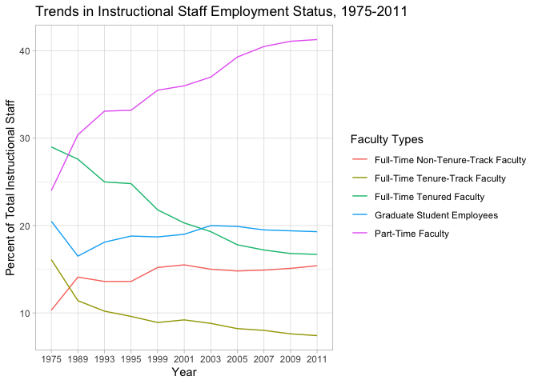

Lab 06 - Ugly charts and Simpson’s paradox
================
Cynthia Jiao
2/17/2025

### Load packages and data

``` r
library(tidyverse) 
library(dplyr)
library(dsbox)
library(mosaicData) 
library(readxl)
```

``` r
library(usethis)
use_git_config(
  user.name = "CynthiaJiao",
  user.email = "cynthia.rj.2001@gmail.com"
)
```

### Staff Data

``` r
staff <- read_csv("data/instructional-staff.csv")
```

    ## Rows: 5 Columns: 12
    ## ── Column specification ────────────────────────────────────────────────────────
    ## Delimiter: ","
    ## chr  (1): faculty_type
    ## dbl (11): 1975, 1989, 1993, 1995, 1999, 2001, 2003, 2005, 2007, 2009, 2011
    ## 
    ## ℹ Use `spec()` to retrieve the full column specification for this data.
    ## ℹ Specify the column types or set `show_col_types = FALSE` to quiet this message.

``` r
print(staff)
```

    ## # A tibble: 5 × 12
    ##   faculty_type    `1975` `1989` `1993` `1995` `1999` `2001` `2003` `2005` `2007`
    ##   <chr>            <dbl>  <dbl>  <dbl>  <dbl>  <dbl>  <dbl>  <dbl>  <dbl>  <dbl>
    ## 1 Full-Time Tenu…   29     27.6   25     24.8   21.8   20.3   19.3   17.8   17.2
    ## 2 Full-Time Tenu…   16.1   11.4   10.2    9.6    8.9    9.2    8.8    8.2    8  
    ## 3 Full-Time Non-…   10.3   14.1   13.6   13.6   15.2   15.5   15     14.8   14.9
    ## 4 Part-Time Facu…   24     30.4   33.1   33.2   35.5   36     37     39.3   40.5
    ## 5 Graduate Stude…   20.5   16.5   18.1   18.8   18.7   19     20     19.9   19.5
    ## # ℹ 2 more variables: `2009` <dbl>, `2011` <dbl>

``` r
## converting to long data

staff_long <- staff %>%
  pivot_longer(cols = -faculty_type, names_to = "year") %>%
  mutate(value = as.numeric(value))

staff_long
```

    ## # A tibble: 55 × 3
    ##    faculty_type              year  value
    ##    <chr>                     <chr> <dbl>
    ##  1 Full-Time Tenured Faculty 1975   29  
    ##  2 Full-Time Tenured Faculty 1989   27.6
    ##  3 Full-Time Tenured Faculty 1993   25  
    ##  4 Full-Time Tenured Faculty 1995   24.8
    ##  5 Full-Time Tenured Faculty 1999   21.8
    ##  6 Full-Time Tenured Faculty 2001   20.3
    ##  7 Full-Time Tenured Faculty 2003   19.3
    ##  8 Full-Time Tenured Faculty 2005   17.8
    ##  9 Full-Time Tenured Faculty 2007   17.2
    ## 10 Full-Time Tenured Faculty 2009   16.8
    ## # ℹ 45 more rows

``` r
## line graph for long data!

staff_long %>%
  ggplot(aes(x = year, y = value, color = faculty_type)) +
  geom_line()
```

    ## `geom_line()`: Each group consists of only one observation.
    ## ℹ Do you need to adjust the group aesthetic?

<!-- -->

``` r
## group the observations in faculty type

staff_long %>%
  ggplot(aes(
    x = year,
    y = value,
    group = faculty_type,
    color = faculty_type
  )) +
  geom_line() +
  ggtitle("Trends in Instructional Staff Employment Status, 1975-2011") +
  labs(x = "Year", y = "Percent of Total Instructional Staff", color = "Faculty Types") +
  theme_light()
```

<!-- -->

``` r
## line graph to compare part-time faculty and non part-time faculty trends

# Recode faculty_type into two categories
staff_grouped <- staff_long %>%
  mutate(faculty_group = ifelse(faculty_type == "Part-Time Faculty", 
                                "Part-Time Faculty", 
                                "Non-Part-Time Faculty")) %>%
  group_by(year, faculty_group) %>%
  summarize(value = sum(value), .groups = "drop") 

# Plot only two groups: Part-Time vs. Non-Part-Time
ggplot(staff_grouped, aes(x = year, y = value, color = faculty_group, group = faculty_group)) +
  geom_line(size = 1) +
  ggtitle("Trends in Part-Time vs. Non-Part-Time Faculty (1975-2011)") +
  labs(x = "Year", y = "Percent of Total Instructional Staff", color = "Faculty Type") +
  theme_light()
```

    ## Warning: Using `size` aesthetic for lines was deprecated in ggplot2 3.4.0.
    ## ℹ Please use `linewidth` instead.
    ## This warning is displayed once every 8 hours.
    ## Call `lifecycle::last_lifecycle_warnings()` to see where this warning was
    ## generated.

<!-- -->

### Fisheries Data

The given graphs are hard to read, because there are some huge outliers,
making the rest data hard to read, especially in a 3D pie chart, where
the slices are so small. I think a horizontal bar chart will improve the
readability. It would also be more readable if not all countries are
listed (e.g., only top 10 are listed; rest can be displayed in a table).
In addition, the unit ton seems to be small for the amount of capture,
using a larger unit or a log number would improve the readability.

``` r
fisheries <- read_csv("data/fisheries.csv")
```

    ## Rows: 216 Columns: 4
    ## ── Column specification ────────────────────────────────────────────────────────
    ## Delimiter: ","
    ## chr (1): country
    ## dbl (3): capture, aquaculture, total
    ## 
    ## ℹ Use `spec()` to retrieve the full column specification for this data.
    ## ℹ Specify the column types or set `show_col_types = FALSE` to quiet this message.

``` r
## create hundred thousand ton unit variable & arrange by most capture

fisheries_capture <- fisheries %>% 
  mutate(capture_100_thousand = capture / 1e5) %>%
  arrange(desc(capture_100_thousand)) %>%
  top_n(10, capture_100_thousand) 
  

## create the horizontal bar chart

fisheries_capture %>%
  ggplot(aes(
    y = reorder(country, capture_100_thousand),  # Ensure countries are ordered by capture
    x = capture_100_thousand, 
    fill = capture_100_thousand
  )) +
  geom_col() +  
  ggtitle("Capture by Country, 2016 (in hundred thousand tons)") +
  labs(x = "Fish Capture (Hundred Thousand Tons)", y = "Country") +
  scale_fill_gradient(low = "lightblue", high = "darkblue") + 
  theme_light()
```

<!-- -->

``` r
## create hundred thousand ton unit variable & arrange by most aquaculture

fisheries_aqua <- fisheries %>% 
  mutate(aqua_100_thousand = aquaculture / 1e5) %>%
  arrange(desc(aqua_100_thousand)) %>%
  top_n(10, aqua_100_thousand) 
  

## create the horizontal bar chart

fisheries_aqua %>%
  ggplot(aes(
    y = reorder(country, aqua_100_thousand),  # Ensure countries are ordered by capture
    x = aqua_100_thousand, 
    fill = aqua_100_thousand
  )) +
  geom_col() +  
  ggtitle("Aguaculture by Country, 2016 (in hundred thousand tons)") +
  labs(x = "Fish Aquaculture (Hundred Thousand Tons)", y = "Country") +
  scale_fill_gradient(low = "lightblue", high = "darkblue") + 
  theme_light()
```

<!-- --> \###
Smokers in Whickham Data

``` r
data(Whickham)
??Whickham
library(performance)
```

## Excercise 1, 2, and 3

The data is most likely observational, because no control/randomly
assigned conditions are reported. There are 1314 observations in the
data, each representing a participant. There are 3 variables,
representing their smoker status (categorical), age (continuous), and
whether they are alive/dead (categorical).

``` r
Whickham %>%
  ggplot(aes(
  x = smoker,
  color = smoker,
  fill = smoker
  )) +
  geom_bar() +
  ggtitle("Smoker or Non-smoker?") +
  theme_minimal()
```

<!-- -->

``` r
Whickham %>%
  ggplot(aes(
  x = outcome,
  color = outcome,
  fill = outcome
  )) +
  geom_bar() +
  ggtitle("Life Outcome") +
  theme_minimal()
```

<!-- -->

``` r
Whickham %>%
  ggplot(aes(x = age)) + 
  geom_histogram(binwidth = 5, fill = "steelblue", color = "black", alpha = 0.7) + 
  ggtitle("Age Distribution of Participants") + 
  labs(x = "Age (Years)", y = "Number of Participants") + 
  theme_minimal()
```

<!-- --> \##
Excercise 4 and 5

Just based on the count, there are more alive non-smokers than smokers.
I would probably expect that there is a relationship between smoker and
health outcome such that being a smoker has worse health outcome than
the non-smoker. However, from the graph, it is possible that the number
differences between alive non-smokers vs. smokers are due to the fact
that there are more alive participants in general. Therefore, I would
say this relationship also needs to be examined in relation to age,
where maybe smokers die earlier than non-smokers.

``` r
Whickham %>%
  count(smoker, outcome)
```

    ##   smoker outcome   n
    ## 1     No   Alive 502
    ## 2     No    Dead 230
    ## 3    Yes   Alive 443
    ## 4    Yes    Dead 139

``` r
## graph the relationship between smoker status and life outcome

Whickham %>%
  ggplot(aes(
  x = outcome,
  color = smoker,
  fill = smoker
  )) + 
  geom_bar(position = "dodge") +
  labs(x = "Life outcome", y = "Count") +
  ggtitle("Smoker vs. Non-smoker Life Outcome") +
  theme_minimal()
```

<!-- --> \## Excercise 6
and 7

In the graph, for the 18-44 group, most individuals are alive, with
minimal differences between smokers and non-smokers. For the 45-64
group, death increases, and a higher proportion of smokers are deceased
compared to the younger group. In the 65+ group, deaths are more common,
especially among smokers, suggesting a stronger long-term impact of
smoking on health. This shift can be explained by age-related mortality
risks and the cumulative effects of smoking over time. The contingency
table shows a consistent pattern.

``` r
## add the new variable

Whickham <- Whickham %>%
  mutate(age_cat = case_when(
    age <= 44 ~ "18-44",
    age > 44 & age <= 64 ~ "45-64",
    age > 64 ~ "65+"
    ))

## create a graph for all three variables

Whickham %>%
  count(smoker, age_cat, outcome)
```

    ##    smoker age_cat outcome   n
    ## 1      No   18-44   Alive 327
    ## 2      No   18-44    Dead  12
    ## 3      No   45-64   Alive 147
    ## 4      No   45-64    Dead  53
    ## 5      No     65+   Alive  28
    ## 6      No     65+    Dead 165
    ## 7     Yes   18-44   Alive 270
    ## 8     Yes   18-44    Dead  15
    ## 9     Yes   45-64   Alive 167
    ## 10    Yes   45-64    Dead  80
    ## 11    Yes     65+   Alive   6
    ## 12    Yes     65+    Dead  44

``` r
Whickham %>%
  ggplot(aes(
  x = outcome,
  color = smoker,
  fill = smoker
  )) + 
  geom_bar(position = "dodge") +
  facet_wrap(~ age_cat) +
  labs(x = "Life outcome", y = "Count") +
  ggtitle("Smoker vs. Non-smoker Life Outcome") +
  theme_minimal()
```

<!-- -->
